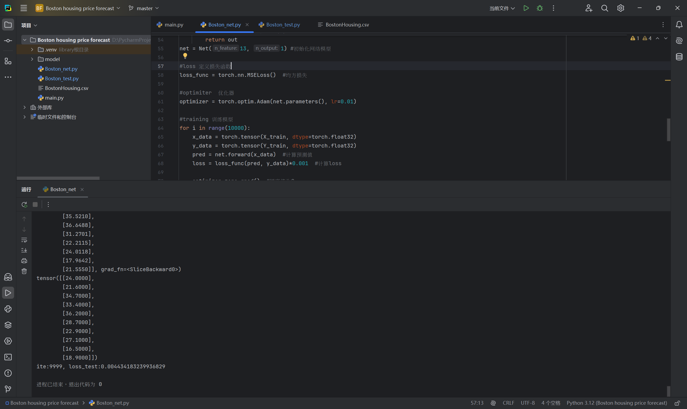
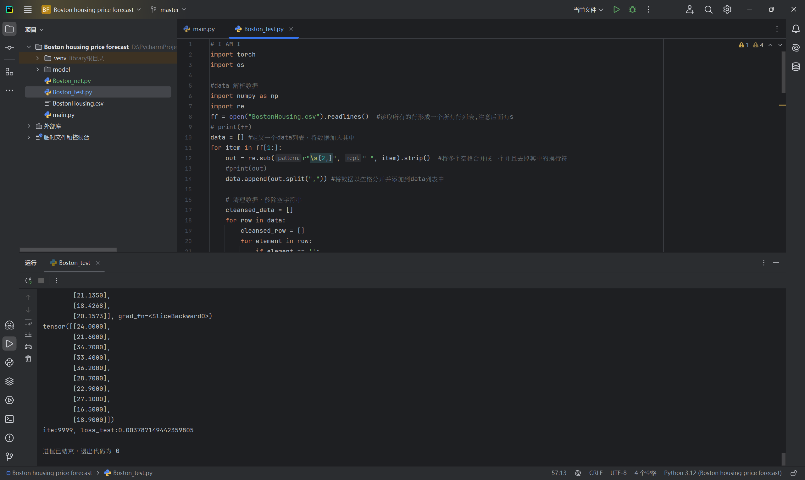

# 实验代码

Boston_net.py

```python
import torch
import os

#data 解析数据
import numpy as np
import re
ff = open("BostonHousing.csv").readlines()  #读取所有的行形成一个所有行列表,注意后面有s
# print(ff)
data = [] #定义一个data列表，将数据加入其中
for item in ff[1:]:
    out = re.sub(r"\s{2,}", " ", item).strip()  #将多个空格合并成一个并且去掉其中的换行符
    #print(out)
    data.append(out.split(",")) #将数据以空格分开并添加到data列表中

    # 清理数据，移除空字符串
    cleansed_data = []
    for row in data:
        cleansed_row = []
        for element in row:
            if element == '':
                cleansed_row.append('0')  # 如果遇到空字符串，将其设置为0
            else:
                cleansed_row.append(element)
        cleansed_data.append(cleansed_row)
# 更新 data 为清理后的数据
data = cleansed_data

data = np.array(data).astype(np.float_) #将数据转换成np矩阵，数据类型为float
#print(data)
print(data.shape)
Y = data[:, -1].reshape(506, 1)
X = data[:, 0:-1].reshape(506, 13)

Y_train = Y[0:496, :]
X_train = X[0:496, :]

Y_test = Y[496:, :]
X_test = X[496:, :]
print(Y_test.shape)
print(X_test.shape)

#net 搭建网络
class Net(torch.nn.Module):  #继承nn.Module
    def __init__(self, n_feature, n_output):
        super(Net, self).__init__()
        self.hidden = torch.nn.Linear(n_feature, 100)
        self.predict = torch.nn.Linear(100, n_output)  #线性回归模型
    def forward(self, x):
        out = self.hidden(x)
        out = torch.relu(out)
        out = self.predict(out)

        return out
net = Net(13, 1) #初始化网络模型

#loss 定义损失函数
loss_func = torch.nn.MSELoss()  #均方损失

#optimiter  优化器
optimizer = torch.optim.Adam(net.parameters(), lr=0.01)

#training 训练模型
for i in range(10000):
    x_data = torch.tensor(X_train, dtype=torch.float32)
    y_data = torch.tensor(Y_train, dtype=torch.float32)
    pred = net.forward(x_data)  #计算预测值
    loss = loss_func(pred, y_data)*0.001  #计算loss

    optimizer.zero_grad()  #梯度值为0
    loss.backward()
    optimizer.step()  #网络中的参数进行更新
    print("ite:{}, loss_train:{}".format(i, loss))
    print(pred[0:10])
    print(y_data[0:10])

#test 测试模型
    x_data = torch.tensor(X_test, dtype=torch.float32)
    y_data = torch.tensor(Y_test, dtype=torch.float32)
    pred = net.forward(x_data)  #计算预测值
    loss_test = loss_func(pred, y_data)*0.001  #计算loss
    print("ite:{}, loss_test:{}".format(i, loss))

#保存模型 1.将整个模型保存下来 2.只是将模型参数保存
if not os.path.exists("model"):
    os.makedirs("model")
torch.save(net, "model/model.pkl")  #将模型整体保存
# torch.load("")                       #加载模型
# torch.save(net.state_dict(), "params.pkl")
# net.load_state_dict("")              #需要先将模型定义出来，然后再将参数加载出来

```

Boston_test.py

```python
import torch

#data 解析数据
import numpy as np
import re
ff = open("BostonHousing.csv").readlines()  #读取所有的行形成一个所有行列表,注意后面有s
# print(ff)
data = [] #定义一个data列表，将数据加入其中
for item in ff[1:]:
    out = re.sub(r"\s{2,}", " ", item).strip()  #将多个空格合并成一个并且去掉其中的换行符
    #print(out)
    data.append(out.split(" ")) #将数据以空格分开并添加到data列表中

    # 清理数据，移除空字符串
    cleansed_data = []
    for row in data:
        cleansed_row = []
        for element in row:
            if element == '':
                cleansed_row.append('0')  # 如果遇到空字符串，将其设置为0
            else:
                cleansed_row.append(element)
        cleansed_data.append(cleansed_row)
# 更新 data 为清理后的数据
data = cleansed_data

data = np.array(data).astype(np.float_) #将数据转换成np矩阵，数据类型为float
#print(data)
print(data.shape)
Y = data[:, -1].reshape(506, 1)
X = data[:, 0:-1].reshape(506, 13)

Y_train = Y[0:496, :]
X_train = X[0:496, :]

Y_test = Y[496:, :]
X_test = X[496:, :]
print(Y_test.shape)
print(X_test.shape)

#net 搭建网络
class Net(torch.nn.Module):  #继承nn.Module
    def __init__(self, n_feature, n_output):
        super(Net, self).__init__()
        self.hidden = torch.nn.Linear(n_feature, 100)
        self.predict = torch.nn.Linear(100, n_output)  #线性回归模型
    def forward(self, x):
        out = self.hidden(x)
        out = torch.relu(out)
        out = self.predict(out)

        return out

net = torch.load("model/model.pkl")  **#加载模型**
#loss 定义损失函数
loss_func = torch.nn.MSELoss()  #均方损失

#test 测试模型
x_data = torch.tensor(X_test, dtype=torch.float32)
y_data = torch.tensor(Y_test, dtype=torch.float32)
pred = net.forward(x_data)  #计算预测值
loss_test = loss_func(pred, y_data)*0.001  #计算loss
print("loss_test:{}".format(loss_test))


```

# 实验过程

### 1. 数据处理

在两个文件中，我都使用了相似的方法来读取和处理波士顿房价数据集 (`BostonHousing.csv`)：

- **读取数据**：使用 `open` 方法读取文件内容，并将每一行存储到 `ff` 列表中。
- **清理数据**：
  - 使用正则表达式将多个空格合并为一个，并去掉行首尾的空格。
  - 将每行数据分割成一个列表，并将其添加到 `data` 列表中。
  - 在清理过程中，如果遇到空字符串，则将其替换为 `'0'`。
- **数据转换**：将数据转换为NumPy数组，并将类型设置为 `float`。
- **分割数据集**：将数据集分为训练集和测试集：
  - 训练集：前496行
  - 测试集：后10行

### 2. 模型结构

我定义了一个简单的神经网络模型 `Net`，其结构如下：

- **输入层**：包含13个特征（特征数目与波士顿房价数据集中的特征数量相同）。
- **隐藏层**：一个全连接层，包含100个神经元，使用ReLU激活函数。
- **输出层**：一个全连接层，输出1个值（预测房价）。

```python
class Net(torch.nn.Module):
    def __init__(self, n_feature, n_output):
        super(Net, self).__init__()
        self.hidden = torch.nn.Linear(n_feature, 100)
        self.predict = torch.nn.Linear(100, n_output)

    def forward(self, x):
        out = self.hidden(x)
        out = torch.relu(out)
        out = self.predict(out)
        return out
```

### 3. 训练过程

在第一个文件中，模型的训练过程如下：

- **损失函数**：使用均方误差（MSE）作为损失函数。
- **优化器**：使用Adam优化器，学习率设置为0.01。
- **训练循环**：
  - 进行10000次迭代，每次迭代中：
    - 将训练数据转换为Tensor。
    - 计算预测值。
    - 计算损失值，并进行反向传播以更新模型参数。
    - 每个迭代中打印训练损失和预测值的前10个结果。

```python
for i in range(10000):
    x_data = torch.tensor(X_train, dtype=torch.float32)
    y_data = torch.tensor(Y_train, dtype=torch.float32)
    pred = net.forward(x_data)
    loss = loss_func(pred, y_data) * 0.001
    optimizer.zero_grad()
    loss.backward()
    optimizer.step()
```

### 4. 测试过程

在第二个文件中，测试过程如下：

- **加载模型**：从保存的文件中加载模型。
- **测试**：
  - 将测试数据转换为Tensor。
  - 计算预测值。
  - 计算并打印测试损失。

```python
net = torch.load("model/model.pkl")  # 加载模型
x_data = torch.tensor(X_test, dtype=torch.float32)
y_data = torch.tensor(Y_test, dtype=torch.float32)
pred = net.forward(x_data)
loss_test = loss_func(pred, y_data) * 0.001
print("loss_test:{}".format(loss_test))
```

# 结果分析





### 1. 损失值分析

- **损失值的意义**：均方误差（MSE）损失值表示预测值与真实值之间的平均平方差。损失值越小，模型的预测性能通常越好。
- **损失值的绝对大小**：
  - 0.0038的损失值相对较小，表明模型在测试集上有良好的拟合效果。一般来说，较小的MSE值意味着模型的预测结果与实际值非常接近。

### 2. 模型性能

- **良好的泛化能力**：由于损失值在测试集上较小，说明模型没有出现过拟合的现象，能够较好地泛化到未见过的数据。
- **可接受的预测精度**：如果房价的范围较广，0.0038可能是一个可接受的误差；如果房价的变化范围较小，可能需要进一步优化模型以减少损失值。

### 3. 可改进的地方

- **进一步调优**：虽然损失值已经较小，但可以尝试以下方法来进一步提升模型性能：
  - 调整网络架构，例如增加隐藏层数量或神经元数量。
  - 采用不同的激活函数（如Leaky ReLU或ELU）进行实验。
  - 调整学习率或其他超参数，以提高收敛速度和最终性能。
  - 尝试不同的优化算法，比如SGD或RMSprop。
  
- **使用更多数据**：如果可能，增加更多的训练数据可以帮助模型更好地学习特征，进一步提高预测能力。

### 4. 评估标准

- **R²决定系数**：衡量模型解释目标变量方差的能力。
- **平均绝对误差（MAE）**：可以用来补充MSE，提供直观的预测误差解释。
- **可视化**：绘制真实值与预测值的散点图，可以更直观地查看模型预测的准确性。

