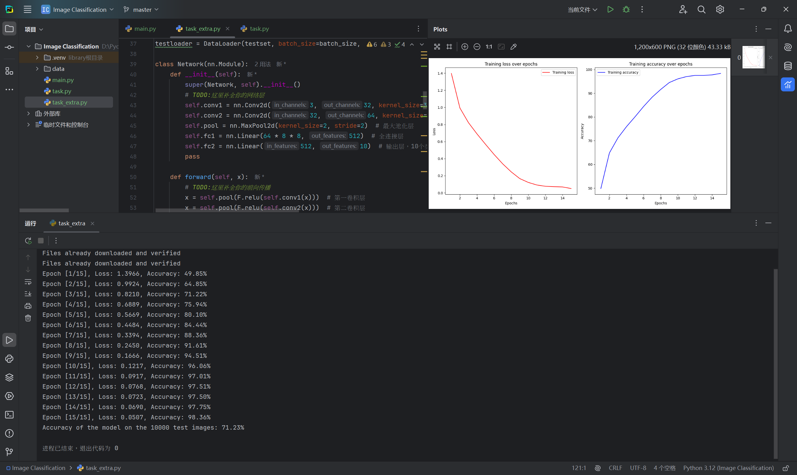

# 做题策略

（做提前的简答题）

### 计算机采用什么数据结构存储、处理图像？

#### 1.**数组（Array）**：

- 图像通常以多维数组的形式存储，常见的是二维数组（灰度图像）或三维数组（彩色图像）。每个元素代表一个像素的值。
  - **灰度图像**：可以用一个二维数组表示，其中每个元素的值表示像素的亮度（0到255）。
  - **彩色图像**：通常用一个三维数组表示，维度分别为高度、宽度和颜色通道（如RGB）。例如，RGB图像的数组维度为`[height, width, 3]`。

#### 2.**图像对象（Image Object）**：

- 在某些编程语言和图像处理库（如Python的PIL/Pillow库）中，图像被封装为对象，提供方便的接口来访问和操作图像数据。这种对象通常会包含图像的元数据（如格式、大小）以及实际的像素数据。

#### 3.**链表（Linked List）**：

- 在一些特定的图像处理应用中，链表可以用来存储图像的像素数据，尤其是在图像分割和处理稀疏数据时。链表允许动态地添加和删除像素。

#### 4.**哈希表（Hash Table）**：

- 在图像处理的一些特定算法（如图像检索或特征匹配）中，哈希表可以用来快速索引和查找图像特征。

#### 5.**树（Tree）**：

- 某些高级图像处理和计算机视觉任务中，像分层图像或决策树结构可以用来组织和处理图像数据。例如，Quad-tree结构常用于表示二维空间的图像数据。

#### 6.**图（Graph）**：

- 在图像分割和特征提取等任务中，图数据结构可以用于表示像素之间的关系。每个像素可以被视为图中的节点，而相邻像素之间的连接表示它们的关系。

### 如何设计一个神经网络？一个神经网络通常包括哪些部分？

设计一个神经网络通常包括以下几个步骤和组成部分。下面将详细介绍每个部分。

#### 1. **确定任务和数据**
   - **任务类型**：首先确定你要解决的任务类型（如分类、回归、目标检测等）。这将影响网络架构的选择。
   - **数据准备**：收集并准备数据，包括数据清洗、标注和预处理（如归一化、增强等）。

#### 2. **选择网络架构**
   - **输入层**：定义输入层的形状，通常取决于数据的格式。例如，图像数据通常为`(高度, 宽度, 通道数)`。
   - **隐藏层**：选择隐藏层的数量和每层的神经元（或单元）数量。常见的隐藏层类型包括：
     - **全连接层（Dense Layer）**：每个神经元与前一层的所有神经元相连。
     - **卷积层（Convolutional Layer）**：用于处理图像数据，提取局部特征。
     - **循环层（Recurrent Layer）**：用于处理序列数据，如时间序列或自然语言。
     - **池化层（Pooling Layer）**：用于降低维度、减少计算量和提取特征。
   - **输出层**：根据任务类型确定输出层的结构。例如，对于二分类任务，输出层通常有一个神经元（使用Sigmoid激活），而对于多分类任务，则需要与类别数相同的神经元（使用Softmax激活）。

#### 3. **选择激活函数**
   - 激活函数决定了神经元的输出。常见的激活函数包括：
     - **ReLU（Rectified Linear Unit）**：在隐藏层中广泛使用。
     - **Sigmoid**：通常用于二分类任务的输出层。
     - **Softmax**：用于多分类任务的输出层。

#### 4. **选择损失函数**
   - 根据任务选择合适的损失函数：
     - **均方误差（MSE）**：用于回归任务。
     - **交叉熵损失（Cross-Entropy Loss）**：用于分类任务。

#### 5. **选择优化器**
   - 优化器用于更新网络的权重。常见的优化器包括：
     - **SGD（Stochastic Gradient Descent）**：基础的优化算法。
     - **Adam**：自适应学习率的优化器，适用于大多数任务。

#### 6. **训练网络**
   - **前向传播**：通过输入数据计算输出。
   - **计算损失**：根据输出和真实标签计算损失。
   - **反向传播**：计算梯度并更新权重。
   - **迭代训练**：重复上述过程多个周期（epoch），直至达到预期的性能。

#### 7. **评估与优化**
   - **验证与测试**：使用验证集和测试集评估模型的性能。
   - **超参数调整**：根据模型性能调整超参数（如学习率、批处理大小、网络层数等）。
   - **防止过拟合**：使用正则化（如L2正则化、Dropout）或数据增强来提高模型的泛化能力。

#### 8. **部署与应用**
   - 将训练好的模型部署到生产环境中，以便在实际应用中使用。


### 什么是欠拟合？什么是过拟合？

欠拟合（Underfitting）和过拟合（Overfitting）是机器学习模型在训练过程中可能遇到的两种问题，影响模型的泛化能力。以下是它们的详细解释：

#### 1. 欠拟合（Underfitting）

**定义**：
欠拟合是指模型在训练数据和测试数据上的表现都不好，无法捕捉数据的基本模式。这通常是由于模型过于简单，无法学习到数据中的重要特征。

**表现**：
- 模型的训练误差（训练集上的损失）和测试误差（验证集或测试集上的损失）都很高。
- 模型无法有效地解释数据，导致在预测时产生较大的误差。

**原因**：
- 选择了过于简单的模型（例如线性回归处理复杂的非线性数据）。
- 特征选择不充分，未能提取出对预测有用的信息。
- 数据量不足，不能覆盖问题的复杂性。

**解决方案**：
- 使用更复杂的模型（例如更深的神经网络）。
- 增加更多的特征（特征工程）。
- 适当增加训练数据集的数量。

#### 2. 过拟合（Overfitting）

**定义**：
过拟合是指模型在训练数据上表现很好，但在测试数据上的表现很差。模型过于复杂，以至于捕捉了数据中的噪声和随机性，而不是实际的底层模式。

**表现**：
- 模型的训练误差很低，但测试误差很高，表现出明显的差距。
- 模型对训练集的细节过于敏感，无法泛化到未见过的数据。

**原因**：
- 选择了过于复杂的模型（例如深层神经网络）。
- 训练数据量不足，模型在有限的数据上过度调整。
- 缺乏正则化措施，导致模型过度拟合训练数据。

**解决方案**：
- 简化模型结构（减少层数或每层的神经元数量）。
- 增加正则化技术（如L1/L2正则化、Dropout等）。
- 使用交叉验证来更好地评估模型的性能。
- 增加训练数据集的数量，帮助模型学习到更一般化的特征。

# 代码

（备注：task.py与task_extra.py是同一个代码）

```python
import NET
import torch
import torch.nn as nn
import torch.optim as optim
import torchvision
import torchvision.transforms as transforms
from torch.testing._internal.common_quantization import accuracy as quant_accuracy
from torch.utils.data import DataLoader
import torch.nn.functional as F
import matplotlib.pyplot as plt

device = torch.device("cuda" if torch.cuda.is_available() else "cpu")

# TODO:解释参数含义，在?处填入合适的参数
batch_size =64 # 批处理大小
#batch_size指的是在训练神经网络时，一次训练过程中使用的样本数量。
#1：内存限制：较大的 batch_size 会占用更多的显存。如果显存不足，则需要减小 batch_size。
#2：训练稳定性和速度：较大的 batch_size 使得梯度估计更稳定，但每次参数更新的计算成本更高。较小的 batch_size 反之。
learning_rate =0.001 # 初始学习率
#learning_rate（学习率）是训练神经网络时需要调试的重要超参数。设置合适的学习率对模型的收敛速度和最终精度都有很大影响。
#调整学习率时，通常遵循以下几条经验法则：
#初始值选择：一个常见的初始值是 0.001 或 0.01 。
#观察梯度下降过程：如果在训练过程中发现损失函数下降得非常缓慢，可以尝试增大学习率；如果发现训练损失上下震荡或者发散（越来越大），则需要减小学习率。
#学习率衰减：在训练过程中逐渐减小学习率也是一种常见的方法，可以帮助模型更好地收敛。
num_epochs = 15 # 训练周期数

transform = transforms.Compose([
    transforms.ToTensor()
])

# root可以换为你自己的路径
trainset = torchvision.datasets.CIFAR10(root='./data', train=True, download=True, transform=transform)
trainloader = DataLoader(trainset, batch_size=batch_size, shuffle=True)

testset = torchvision.datasets.CIFAR10(root='./data', train=False, download=True, transform=transform)
testloader = DataLoader(testset, batch_size=batch_size, shuffle=False)

class Network(nn.Module):
    def __init__(self):
        super(Network, self).__init__()
        # TODO:这里补全你的网络层
        self.conv1 = nn.Conv2d(3, 32, kernel_size=3, padding=1)  # 输入通道数为3（RGB），输出通道数为32
        self.conv2 = nn.Conv2d(32, 64, kernel_size=3, padding=1)  # 输入通道数为32，输出通道数为64
        self.pool = nn.MaxPool2d(kernel_size=2, stride=2)  # 最大池化层
        self.fc1 = nn.Linear(64 * 8 * 8, 512)  # 全连接层
        self.fc2 = nn.Linear(512, 10)  # 输出层，10个类
        pass

    def forward(self, x):
        # TODO:这里补全你的前向传播
        x = self.pool(F.relu(self.conv1(x)))  # 第一卷积层
        x = self.pool(F.relu(self.conv2(x)))  # 第二卷积层
        x = x.view(-1, 64 * 8 * 8)  # 展平
        x = F.relu(self.fc1(x))  # 第一全连接层
        x = self.fc2(x)  # 输出层
        return x
        pass

# TODO:补全
model = Network().to(device)
criterion =nn.CrossEntropyLoss()
optimizer = torch.optim.Adam(model.parameters(), lr=learning_rate)

# 用于存储loss和accuracy的数据
train_losses = []
train_accuracies = []

def train():
    model.train()
    for epoch in range(num_epochs):
        running_loss = 0.0
        correct = 0
        total = 0
        for i, data in enumerate(trainloader, 0):
            inputs, labels = data
            inputs, labels = inputs.to(device), labels.to(device)

            optimizer.zero_grad()

            outputs = model(inputs)
            loss = criterion(outputs, labels)

            loss.backward()
            optimizer.step()

            running_loss += loss.item()

            _, predicted = torch.max(outputs.data, 1)
            total += labels.size(0)
            correct += (predicted == labels).sum().item()
        epoch_loss = running_loss / len(trainloader)
        epoch_accuracy = 100 * correct / total
        train_losses.append(epoch_loss)
        train_accuracies.append(epoch_accuracy)
        print(f'Epoch [{epoch + 1}/{num_epochs}], Loss: {running_loss / len(trainloader):.4f}, Accuracy: {epoch_accuracy:.2f}%')

def test():
    model.eval()
    correct = 0
    total = 0
    with torch.no_grad():
        for data in testloader:
            images, labels = data
            images, labels = images.to(device), labels.to(device)
            outputs = model(images)
            _, predicted = torch.max(outputs.data, 1)
            total += labels.size(0)
            correct += (predicted == labels).sum().item()

    accuracy = 100 * correct / total
    print(f'Accuracy of the model on the 10000 test images: {accuracy:.2f}%')

if __name__ == "__main__":
    train()
    test()


# 绘制损失和准确率曲线
    epochs = range(1, num_epochs + 1)

    plt.figure(figsize=(12, 6))
    # 绘制训练损失曲线
    plt.subplot(1, 2, 1)
    plt.plot(epochs, train_losses, 'r', label='Training loss')
    plt.title('Training loss over epochs')
    plt.xlabel('Epochs')
    plt.ylabel('Loss')
    plt.legend()
    # 绘制训练准确率曲线
    plt.subplot(1, 2, 2)
    plt.plot(epochs, train_accuracies, 'b', label='Training accuracy')
    plt.title('Training accuracy over epochs')
    plt.xlabel('Epochs')
    plt.ylabel('Accuracy')
    plt.legend()
    plt.tight_layout()
    plt.show()

```

# 实现思路

### 1. 导入必要的库
```python
import NET
import torch
import torch.nn as nn
import torch.optim as optim
import torchvision
import torchvision.transforms as transforms
from torch.testing._internal.common_quantization import accuracy as quant_accuracy
from torch.utils.data import DataLoader
import torch.nn.functional as F
import matplotlib.pyplot as plt
```
- **`torch`**: PyTorch库，提供深度学习功能。
- **`torchvision`**: 用于计算机视觉任务的库，包含常用数据集和预处理工具。
- **`matplotlib.pyplot`**: 用于绘图，绘制训练过程中的损失和准确率曲线。

### 2. 选择计算设备
```python
device = torch.device("cuda" if torch.cuda.is_available() else "cpu")
```
- 检查是否有可用的GPU，如果有则使用GPU，否则使用CPU进行计算。

### 3. 定义超参数
```python
batch_size = 64  # 批处理大小
learning_rate = 0.001  # 初始学习率
num_epochs = 15  # 训练周期数
```
- **`batch_size`**: 一次训练中使用的样本数量，影响训练的速度和内存使用。
- **`learning_rate`**: 学习率控制模型权重更新的幅度，需调整以获得最佳性能。
- **`num_epochs`**: 训练过程中遍历整个训练集的次数。

### 4. 数据预处理和加载
```python
transform = transforms.Compose([
    transforms.ToTensor()
])

trainset = torchvision.datasets.CIFAR10(root='./data', train=True, download=True, transform=transform)
trainloader = DataLoader(trainset, batch_size=batch_size, shuffle=True)

testset = torchvision.datasets.CIFAR10(root='./data', train=False, download=True, transform=transform)
testloader = DataLoader(testset, batch_size=batch_size, shuffle=False)
```
- 使用`torchvision`加载CIFAR-10数据集，并将其转换为张量格式，准备输入神经网络。
- 创建训练集和测试集的DataLoader，允许批量处理数据。

### 5. 定义神经网络
```python
class Network(nn.Module):
    def __init__(self):
        super(Network, self).__init__()
        self.conv1 = nn.Conv2d(3, 32, kernel_size=3, padding=1)  # 第一卷积层
        self.conv2 = nn.Conv2d(32, 64, kernel_size=3, padding=1)  # 第二卷积层
        self.pool = nn.MaxPool2d(kernel_size=2, stride=2)  # 最大池化层
        self.fc1 = nn.Linear(64 * 8 * 8, 512)  # 全连接层
        self.fc2 = nn.Linear(512, 10)  # 输出层
```
- 定义一个名为`Network`的类，继承自`nn.Module`。
- 初始化卷积层、池化层和全连接层。
- **`conv1`和`conv2`**: 卷积层，负责提取特征。
- **`pool`**: 池化层，减少特征图的尺寸。
- **`fc1`和`fc2`**: 全连接层，用于最终分类。

### 6. 前向传播
```python
def forward(self, x):
    x = self.pool(F.relu(self.conv1(x)))  # 第一卷积层
    x = self.pool(F.relu(self.conv2(x)))  # 第二卷积层
    x = x.view(-1, 64 * 8 * 8)  # 展平
    x = F.relu(self.fc1(x))  # 第一全连接层
    x = self.fc2(x)  # 输出层
    return x
```
- 定义`forward`方法实现前向传播。
- 输入经过卷积层和池化层提取特征，然后展平并通过全连接层生成最终输出。

### 7. 创建模型、损失函数和优化器
```python
model = Network().to(device)
criterion = nn.CrossEntropyLoss()  # 损失函数
optimizer = torch.optim.Adam(model.parameters(), lr=learning_rate)  # 优化器
```
- 实例化模型并将其移动到计算设备上。
- 使用交叉熵损失函数进行分类任务。
- 使用Adam优化器优化模型参数。

### 8. 训练过程
```python
def train():
    model.train()  # 切换到训练模式
    for epoch in range(num_epochs):
        running_loss = 0.0
        correct = 0
        total = 0
        for i, data in enumerate(trainloader, 0):
            inputs, labels = data
            inputs, labels = inputs.to(device), labels.to(device)

            optimizer.zero_grad()  # 清零梯度
            outputs = model(inputs)  # 前向传播
            loss = criterion(outputs, labels)  # 计算损失
            loss.backward()  # 反向传播
            optimizer.step()  # 更新参数

            running_loss += loss.item()  # 累加损失
            _, predicted = torch.max(outputs.data, 1)  # 获取预测标签
            total += labels.size(0)  # 总样本数
            correct += (predicted == labels).sum().item()  # 正确预测数量

        epoch_loss = running_loss / len(trainloader)  # 计算每个周期的平均损失
        epoch_accuracy = 100 * correct / total  # 计算准确率
        train_losses.append(epoch_loss)  # 存储损失
        train_accuracies.append(epoch_accuracy)  # 存储准确率
        print(f'Epoch [{epoch + 1}/{num_epochs}], Loss: {epoch_loss:.4f}, Accuracy: {epoch_accuracy:.2f}%')
```
- 切换模型到训练模式，进行多个训练周期（epochs）。
- 对于每个周期，遍历训练集，进行前向传播、损失计算、反向传播和参数更新。
- 记录每个周期的损失和准确率并输出。

### 9. 测试过程
```python
def test():
    model.eval()  # 切换到评估模式
    correct = 0
    total = 0
    with torch.no_grad():  # 不需要计算梯度
        for data in testloader:
            images, labels = data
            images, labels = images.to(device), labels.to(device)
            outputs = model(images)
            _, predicted = torch.max(outputs.data, 1)
            total += labels.size(0)
            correct += (predicted == labels).sum().item()

    accuracy = 100 * correct / total  # 计算准确率
    print(f'Accuracy of the model on the 10000 test images: {accuracy:.2f}%')
```
- 切换模型到评估模式，遍历测试集，计算并输出模型在测试集上的准确率。

### 10. 主函数
```python
if __name__ == "__main__":
    train()  # 开始训练
    test()  # 开始测试
```
- 运行训练和测试过程。

### 11. 绘制损失和准确率曲线
```python
epochs = range(1, num_epochs + 1)

plt.figure(figsize=(12, 6))
plt.subplot(1, 2, 1)
plt.plot(epochs, train_losses, 'r', label='Training loss')
plt.title('Training loss over epochs')
plt.xlabel('Epochs')
plt.ylabel('Loss')
plt.legend()

plt.subplot(1, 2, 2)
plt.plot(epochs, train_accuracies, 'b', label='Training accuracy')
plt.title('Training accuracy over epochs')
plt.xlabel('Epochs')
plt.ylabel('Accuracy')
plt.legend()

plt.tight_layout()
plt.show()
```
- 使用Matplotlib绘制训练过程中的损失和准确率曲线，以便可视化模型性能。

# 遇到的困难与解决方案

#### 1.**数据加载问题**：

- **困难**：在加载数据集时，可能会遇到路径错误或数据集下载失败的情况。
- **解决方案**：确保指定的数据集路径正确，如果下载失败，可以手动下载数据集并放置在指定位置。

#### 2.**模型架构设计**：

- **困难**：在定义神经网络结构时，可能对各层的参数（如卷积层的输入输出通道、全连接层的维度）不够清晰。
- **解决方案**：可以参考已有的模型架构或文献，逐步构建，并在每一层后打印输出的形状以确保正确。

#### 3.**训练过程中的收敛问题**：

- **困难**：如果训练损失不下降，或者准确率不提升，可能是学习率设置不合适或模型过于复杂。
- **解决方案**：尝试调整学习率，或者修改网络结构以简化模型，避免过拟合。

#### 4.**绘图问题**：

- **困难**：在绘制损失和准确率曲线时，可能因为数据未正确收集而导致图形不完整。
- **解决方案**：确保在训练过程中记录每个周期的损失和准确率，并检查 `plt.show()` 的调用顺序。

# 实验结果



### 训练过程分析

1. **损失和准确率变化**：
   - 在15个训练周期中，损失逐渐降低，从第一周期的 **1.3966** 降到最后一周期的 **0.0507**，显示出模型在逐步学习和优化。
   - 准确率也呈现上升趋势，从 **49.85%** 提高到 **98.36%**，表明模型逐渐掌握了数据中的特征。

2. **收敛情况**：
   - 训练损失和准确率的变化表明模型在训练集上的拟合情况良好。尤其是损失在每个周期都有显著下降，且准确率不断上升，说明模型在有效学习。

3. **训练效果**：
   - 在前几个周期，损失下降较快，这通常是模型开始学习特征的阶段。之后，损失下降速度减缓，准确率的提高也逐渐趋于平稳，说明模型逐渐趋向饱和。

### 测试结果分析

1. **测试准确率**：
   - 在训练结束后，模型在测试集上的准确率为 **71.23%**。虽然训练集上的准确率非常高（98.36%），但测试集上的表现相对较低，显示出一定的过拟合现象。

### 过拟合分析

- **过拟合的表现**：
  - 在训练集上的准确率远高于测试集准确率，说明模型在训练集上学到了很多特定于训练数据的特征，但未能很好地泛化到未见过的数据（测试集）。

- **可能原因**：
  - 模型的复杂度较高（例如，使用了多个卷积层和全连接层），这可能导致模型在训练数据上过度拟合。
  - 训练周期过多，虽然训练损失逐渐减小，但可能导致模型对训练数据的特定噪声和特征过于敏感。

### 改进建议

1. **正则化**：
   - 可以在模型中加入 dropout 层，或使用 L2 正则化，以减少过拟合。

2. **数据增强**：
   - 通过增加数据集的多样性（如旋转、平移、缩放等），提高模型的泛化能力。

3. **调整训练策略**：
   - 可以考虑减少训练周期数，或者使用早停法（Early Stopping），即在验证损失不再降低时停止训练。

4. **学习率调整**：
   - 训练过程中逐步减小学习率，有助于模型在接近最优解时更细致地调整参数。

5. **模型简化**：
   - 尝试简化模型架构，减少层数或神经元数目，从而降低过拟合的风险。
